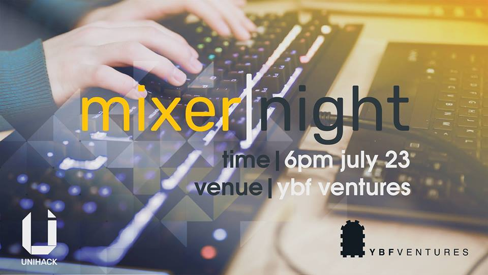

# Mixer Night

Mixer Night returns for another year. It is our way to help competitors find
teammates, discuss hack ideas and meet other students and professionals.

The big news we’ve got for you is that this year, we will also be focusing on
showcasing the different software and hardware products that some of our
sponsors will be supplying for you to utilise within your hack. You will get to
learn about them, how to use them and start thinking about how they can help
improve your project.

If you were thinking about using any APIs or hardware tools in your hack, then
Mixer Night will give you a head start in planning your wonderfully magical
hacks.

This will also be an opportunity for people to find team members. So if you are looking, then we highly suggest you attend! We will also be using CrowdForge this year, so during the night, hop on to: https://crowdforge.io/hackathons/unihack_melbourne

The Mixer Night begins at 6:00pm on July 23. You can RSVP by clicking the below
link.

<a href="https://docs.google.com/forms/d/e/1FAIpQLSeWYtI49LPovtKd9p6oYI3nlQayqeS6LqNdYvZy1U2VWyMxOg/viewform" class="btn btn-primary btn-lg btn-block">RSVP Today</a>

## Location

**YBF Venutres**  
520 Bourke Street  
Melbourne VIC 3000

### Getting There

The best way to get to YBF Ventures is taking a train to Southern Cross or Parliament
station and getting the 56, 86 or 96 tram to William Street.
