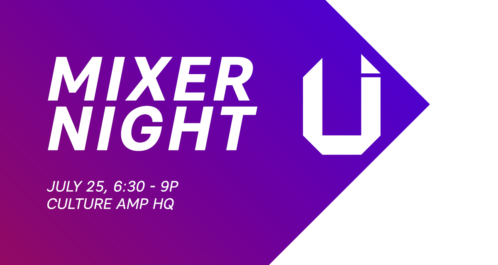

# Mixer Night

Mixer Night returns for another year. It is our way to help competitors find
teammates, discuss hack ideas and meet other students and professionals.

The big news we’ve got for you is that this year, we will also be focusing on
showcasing the different software and hardware products that some of our
sponsors - Accenture, IttyBittyApps, Bosch and Microsoft - will be supplying for
you to utilise within your hack. You will get to learn about them, how to use
them and start thinking about how they can help improve your project.

If you were thinking about using any APIs or hardware tools in your hack, then
Mixer Night will give you a head start in planning your wonderfully magical
hacks.

The Mixer Night begins at 6:30pm on July 25. You can RSVP by clicking the below
link.

<a href="https://docs.google.com/forms/d/e/1FAIpQLScz1DvMXMws_G0AWbski8AV6lRgPC3L6gs7s1ytQWOts3Q4-g/viewform" class="btn btn-primary btn-lg btn-block">RSVP Today</a>

## Location

**Culture Amp**  
Level 10, 31 Queen Street  
Melbourne VIC 3000

### Getting There

The best way is to get public transport or Uber. If you are taking public
transport, the best method is simply catch the 11, 12, 48 or 109 tram to
William Street; or the 35 (City Circle), 70 or 75 tram to Market Street.

If catching a train to the venue, the nearest train station is Finders Street
Station. After arriving, complete your journey by catching a 35 (City Circle),
70 or 75 tram to Market Street.

If you plan on driving into the city, the nearest and most affordable carpark
will be [300 Flinders Street](http://www.secureparking.com.au/car-parks/australia/vic/melbourne/Melbourne%20CBD/300-flinders-street).
Parking is $11 flat fee - but you must park after 4pm and leave before 6am the
next day.
